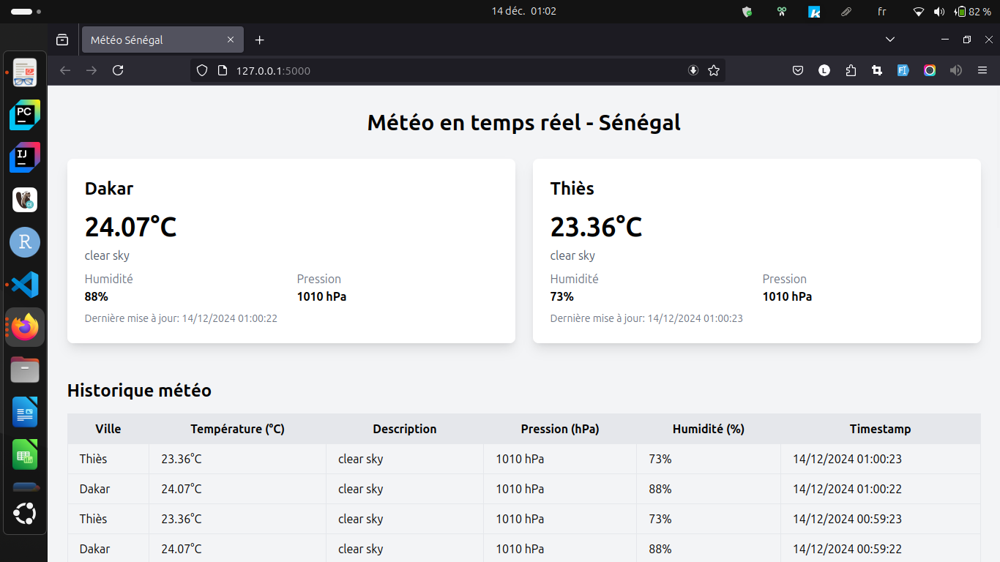

# Flask Weather App

Ce projet est une application web qui utilise Flask pour afficher et stocker les données météo de différentes villes en se basant sur l'API [OpenWeatherMap](https://openweathermap.org/). La version gratuite de l'API permet de d'avoir les données de la [météo courante](https://openweathermap.org/current#one) et d'avoir des previsions météo pour les [5 prochains jours](https://openweathermap.org/forecast5#data). Les données météo sont enregistrées dans une base de données PostgreSQL et peuvent être consultées via des endpoints API ou une interface web.

## EQUIPE

1. **[Wendtoin Issaka OUEDRAOGO](#)**  ------------------>  [CV](cv/cv_issaka.pdf)  

2. **[Mafoya Elie Abissola ADJOBO](#)**  ------------------->  [CV](cv/CV%20Elie%20Adjobo.pdf)



---
## Fonctionnalités

- Récupération des données météo (actuelles et previsionnelles) pour des villes prédéfinies (Dakar, Thiès).
- Stockage des données dans une base de données PostgreSQL.
- Consultation des dernières données météo via une API RESTful.
- Consultation de l'historique météo d'une ville spécifique ou de toutes les villes via l'API RESTful.
- Planification automatique des mises à jour des données météo avec `APScheduler`.
---
## Prérequis

- **Python 3.10 ou plus**
- **Docker et Docker Compose**
- Un compte sur l'API OpenWeather pour obtenir une clé API.
---


## Installation

1. Clonez ce dépôt :
   ```bash
   git clone https://github.com/wendtoinissaka/databeez-projet-data-engineer.git
   cd databeez-projet-data-engineer
   ```

2. Créez un fichier .env en vous basant sur le fichier .env copy
   ```bash
   cp .env\ copy .env
   ```

3. Construisez et démarrez les conteneurs Docker :
   ```bash
   docker-compose up --build
   ```

4. Accédez à l'application sur votre navigateur :   
     ```env
     http://localhost:5000
     
     ```

---

## Utilisation

1. Endpoints API disponibles :
   - **Dernières données météo par ville** :
     ```
        GET /api/weather/current
     ```
   - **Historique météo d'une ville (Dakar; Thiès)** :
     ```
        GET /api/weather/history/<city>
     ```
     Exemple : `/api/weather/history/Dakar`
   - **Historique météo de toutes les villes** :
     ```
        GET /api/weather/history/all
     ```
---

## Dashboards realisés avec PowerBI

1. Prévision météo pour la région de Dakar :


2. Prévision météo pour la région de Thiès :


---
## Contributeurs

14/12/2024
